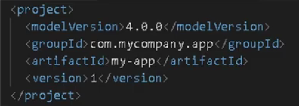

# 📝Anotações <h3>

### 📌Maven <h4>
* Maven archetypes: modelos prontor de projetos para serem usados. 
  * [Apache Maven Archetypes](https://maven.apache.org/archetypes/)
  * [Github Maven Archetypes](https://gist.github.com/zbigniewTomczak/4235871)

### 📌POM - Project Object Model<h4>
* Detalha o projeto (nome do projeto, dependências, módulos, configurações de build e ambiente) e como contruí-lo;
* Maven sempre procura pelo arquivo pom.xml para iniciar a sua execução;

(POM básico)

### 📌Repositórios<h4>
* São locais onde podemos encontrar plugins e bibliotecas que o Maven provê;
* Dois tipos:
    * Remoto: é o local central utilizado pelo Maven para buscar os artefatos. É configurado automaticamente pelo Super Pom para utilizar o Maven Central;
    * Local: é o repositório da máquina utilizado pelo Maven para buscar os artefatos. Localizado na pasta %USERPROFILE%\.m2\repository

### 📌Dependências<h4>
* Podemos adicioná-las ao inserimos o código na área de "dependecies" no arquivo pom.xml;
* Após adicionadas, devemos compilar o projeto novamente (serão encontradas em "External Libraries");
* 

